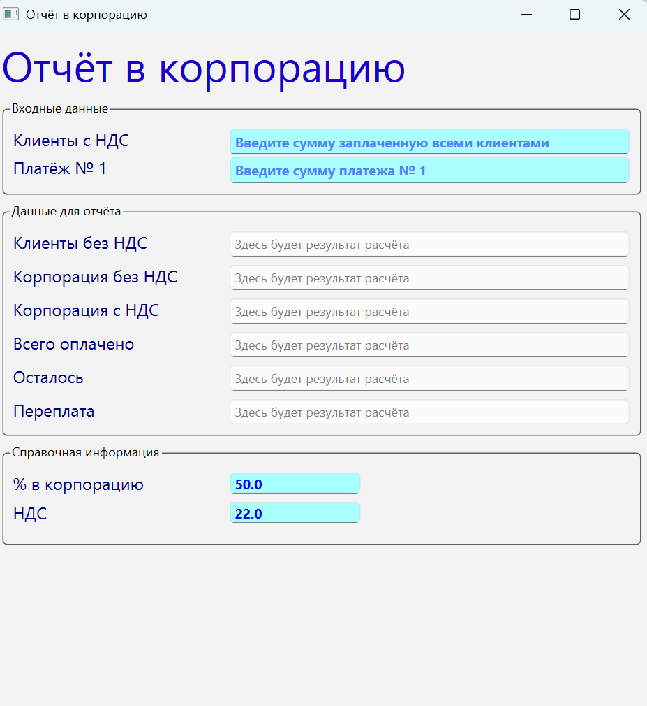
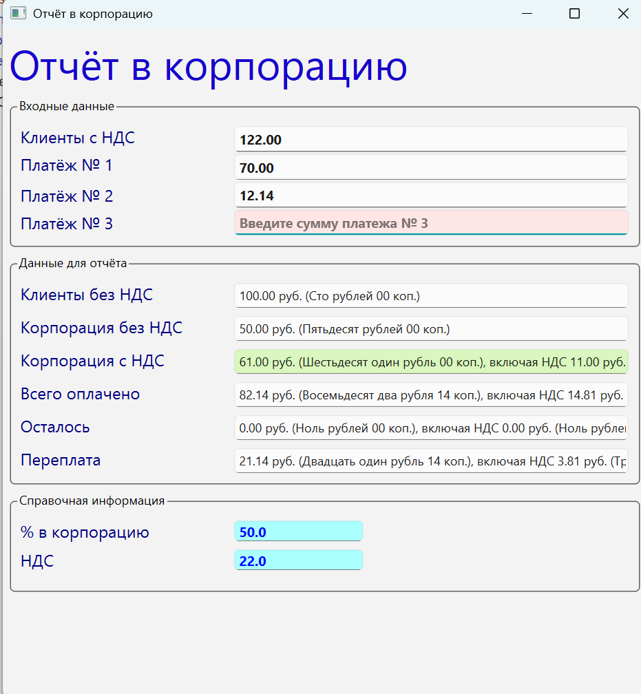
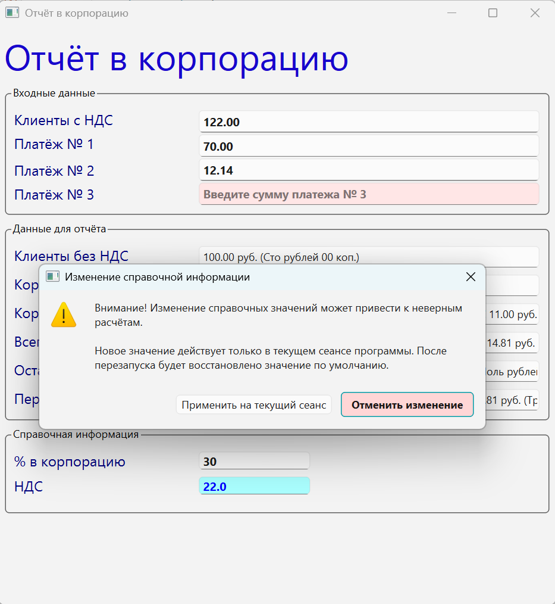

# Galaxy Report

Desktop utility for preparing financial values for a monthly partner report to
the Galaktika corporation.

The application accepts customer payments, corporation payment amounts, and VAT.
Corporation contribution percentage and VAT percentage are defined by program
constants, but can be adjusted in the interface for the current session.

## Features

- PyQt6 desktop interface based on a Qt Designer `.ui` file.
- Automatic calculation of:
  - customer amount without VAT;
  - corporation amount;
  - corporation amount including VAT;
  - total paid amount;
  - remaining amount;
  - overpayment.
- Dynamic payment rows: after entering payment `N`, the next payment field is
  created automatically.
- `Enter` completes input and moves focus like `Tab`.
- Output fields are copied to the clipboard by mouse click.
- Copied output fields are highlighted.
- Automated pytest coverage for calculations, formatting, UI behavior, dynamic
  payments, clipboard copy, and reference-value safeguards.

## Screenshots

Initial form:



Filled form with dynamic payment rows and copied output highlighting:



Reference value confirmation:



## Technology

- Python 3.14
- PyQt6
- num2words
- pytest

## Project Structure

```text
Galaxy_report_2/
├── _internal/report.ui      # Qt Designer interface
├── constants.py             # Application constants
├── functions.py             # Formatting, parsing, clipboard helpers
├── main.py                  # Application entry point
├── report.py                # Main window and business workflow
├── validatedlineedit.py     # Validated input widget
├── test_functions.py        # Unit tests for helpers
├── test_report.py           # UI/workflow tests
└── Galaxy_report.spec       # PyInstaller build spec
```

## Installation

Create and activate a virtual environment, then install dependencies:

```powershell
python -m venv .venv
.\.venv\Scripts\python.exe -m pip install -r requirements.txt
```

## Run

```powershell
.\.venv\Scripts\python.exe main.py
```

You can also run the main window module directly:

```powershell
.\.venv\Scripts\python.exe report.py
```

## Tests

Run tests through the project virtual environment:

```powershell
.\.venv\Scripts\python.exe -m pytest .
```

Current verified result:

```text
17 passed
```

## Build

The repository includes a PyInstaller spec file:

```powershell
pyinstaller Galaxy_report.spec
```

PyInstaller is optional and is not required for development or tests.
